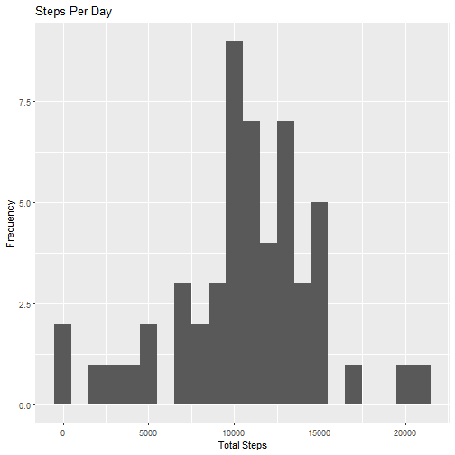
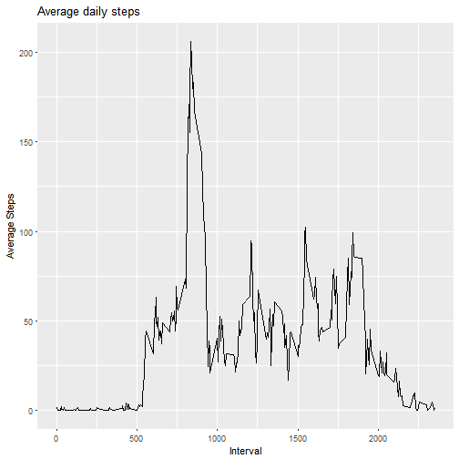
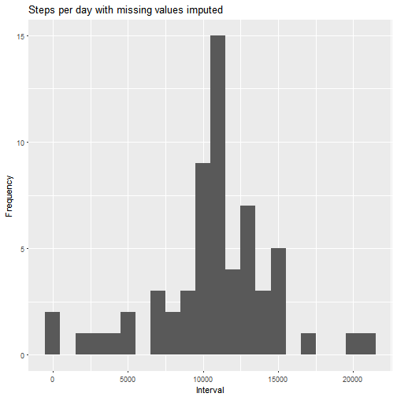
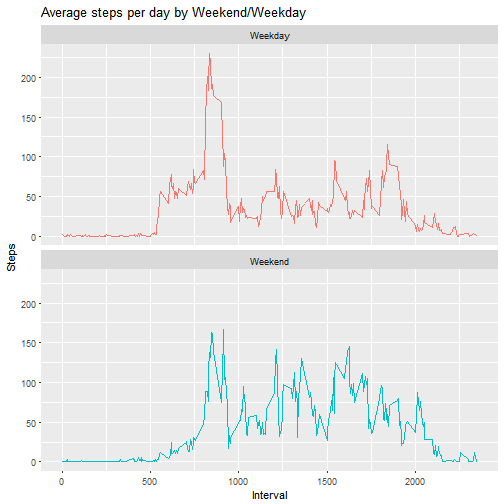

## Loading and preprocessing the data

```r
data<-read.csv("activity.csv")
```

## What is mean total number of steps taken per day?

```r
library(dplyr)
data$date<-as.Date(data$date)
TotalSteps<-data %>% filter(!is.na(steps)) %>% group_by(date) %>% summarize(sum=sum(steps,na.rm=TRUE))
TotalSteps
```

```
## # A tibble: 53 × 2
##          date   sum
##        <date> <int>
## 1  2012-10-02   126
## 2  2012-10-03 11352
## 3  2012-10-04 12116
## 4  2012-10-05 13294
## 5  2012-10-06 15420
## 6  2012-10-07 11015
## 7  2012-10-09 12811
## 8  2012-10-10  9900
## 9  2012-10-11 10304
## 10 2012-10-12 17382
## # ... with 43 more rows
```


```r
library(ggplot2)
ggplot(TotalSteps,aes(x=sum))+geom_histogram(binwidth = 1000)+labs(title="Steps Per Day",x="Total Steps",y="Frequency")
```




```r
MeanSteps<-mean(TotalSteps$sum,na.rm=TRUE)
MeanSteps
```

```
## [1] 10766.19
```


```r
MedianSteps<-median(TotalSteps$sum,na.rm=TRUE)
MedianSteps
```

```
## [1] 10765
```

## What is the average daily activity pattern?

```r
AverageInterval<-data %>% group_by(interval) %>% filter(!is.na(steps)) %>% summarize(avg=mean(steps,na.rm=TRUE))

ggplot(AverageInterval,aes(x=interval,y=avg))+geom_line()+labs(title="Average daily steps",x="Interval",y="Average Steps")
```




```r
MaximumInterval<-AverageInterval[which.max(AverageInterval$avg),]
MaximumInterval[[1]]
```

```
## [1] 835
```

## Imputing missing values

```r
sum(is.na(data))
```

```
## [1] 2304
```

##Impute missing values using mean and create new dataset dataNoNA

```r
MissingData<-is.na(data$steps)
dataNoNA<-data
AvgInterval<-tapply(dataNoNA$steps,dataNoNA$interval,mean,na.rm=TRUE,simplify=TRUE)
dataNoNA$steps[MissingData]<-AvgInterval[as.character(dataNoNA$interval[MissingData])]
sum(is.na(dataNoNA))
```

```
## [1] 0
```


```r
TotalStepsNoNA<-dataNoNA %>% group_by(date) %>% summarize(sum=sum(steps))
ggplot(TotalStepsNoNA,aes(x=sum))+geom_histogram(binwidth=1000)+labs(title="Steps per day with missing values imputed",x="Interval",y="Frequency")
```




```r
MeanStepsNoNA<-mean(TotalStepsNoNA$sum)
MeanStepsNoNA
```

```
## [1] 10766.19
```


```r
MedianStepsNoNA<-median(TotalStepsNoNA$sum)
MedianStepsNoNA
```

```
## [1] 10766.19
```

##The impact of imputing missing data with the mean number of steps is both mean and median are equal (10766.19)

## Are there differences in activity patterns between weekdays and weekends?

```r
dataNoNA<-dataNoNA %>% mutate(weekendOrWeekDay = ifelse(weekdays(date)=="Saturday" | weekdays(date)=="Sunday","Weekend","Weekday"))
```

##Plotting

```r
AverageIntervalNoNA<-dataNoNA %>% group_by(interval,weekendOrWeekDay) %>% summarise(avg=mean(steps))

ggplot(AverageIntervalNoNA,aes(x=interval,y=avg,color=weekendOrWeekDay))+geom_line()+labs(title="Average steps per day by Weekend/Weekday",x="Interval",y="Steps")+facet_wrap(~weekendOrWeekDay,ncol=1,nrow=2)+theme(legend.position = "none")
```


